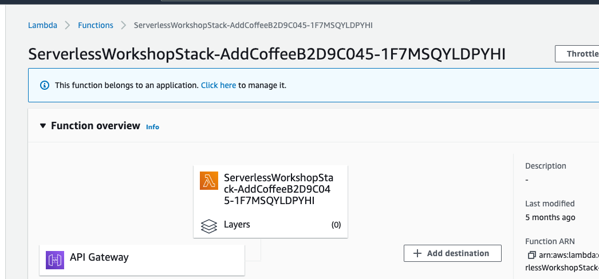
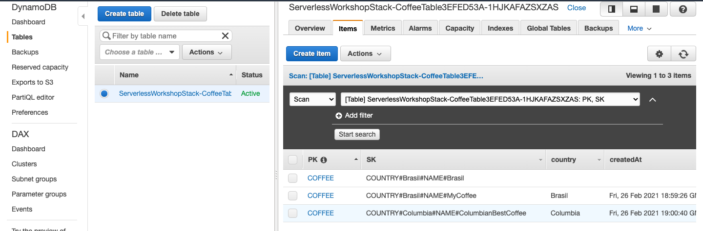

# Demo project

This is an example project for TypeScript development with CDK.
Full list of instruction is posted [here](https://github.com/dabit3/next.js-cdk-amplify-workshop) 

The `cdk.json` file tells the CDK Toolkit how to execute the app.

## Useful commands

 * `npm run build`   compile typescript to js
 * `npm run watch`   watch for changes and compile
 * `npm run test`    perform the jest unit tests
 * `cdk deploy`      deploy this stack to your default AWS account/region
 * `cdk diff`        compare deployed stack with current state
 * `cdk synth`       emits the synthesized CloudFormation template

## Demo results

At the end of the tutorial, you will have auto-deployed infrastructure in AWS 🥳

Lambda function for adding coffee to DB:

DynamoDB with all data:

